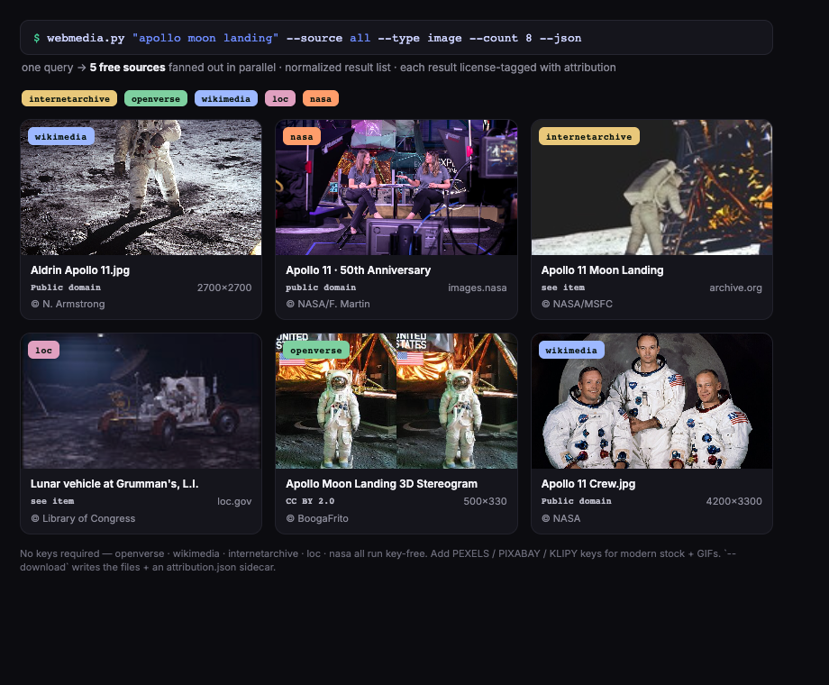

# web-media-getter

**web-media-getter** is a Claude Code skill (and standalone zero-dep CLI) that searches **free image / video / GIF APIs** — Pexels, Pixabay, NASA, Openverse, Wikimedia, Internet Archive, Klipy — in one query and returns a normalized, **license-tagged** result list, with optional download.

> **What this is:** A new capability — Claude has web search, but not a normalized multi-free-media-API search+download. Free to query; respect the per-item license field.

## Install (Claude Code plugin)

```
/plugin marketplace add connerkward/web-media-getter-skill
/plugin install web-media-getter@web-media-getter-skill
```

Or install the whole set: `/plugin marketplace add connerkward/connerkward-skills`. Or drop this repo's `SKILL.md` into your agent's skills directory.

## License

MIT © Conner K Ward

---

# free-stock-media-search

Search free stock photos, videos, and GIFs from the command line — one zero-dependency Python script that queries public-domain, archival, and free-stock APIs (NASA, Wikimedia Commons, Internet Archive, Library of Congress, Openverse, Pexels, Pixabay, GIPHY, KLIPY), returns unified JSON with attribution, and downloads results. No pip installs, no SDKs — Python 3 standard library only.



## Sources

| Source | Type | API key | Get a free key | Env var |
|---|---|---|---|---|
| [Openverse](https://openverse.org) | images | none | — | — |
| [Internet Archive](https://archive.org) | images, video | none | — | — |
| [NASA Image Library](https://images.nasa.gov) | images, video | none | — | — |
| [Wikimedia Commons](https://commons.wikimedia.org) | images | none | — | — |
| [Library of Congress](https://www.loc.gov/photos/) | images | none | — | — |
| [Pexels](https://www.pexels.com) | images, video | free | [pexels.com/api](https://www.pexels.com/api/) | `PEXELS_API_KEY` |
| [Pixabay](https://pixabay.com) | images, video | free | [pixabay.com/api/docs](https://pixabay.com/api/docs/) | `PIXABAY_API_KEY` |
| [GIPHY](https://giphy.com) | GIFs | free | [developers.giphy.com](https://developers.giphy.com/) | `GIPHY_API_KEY` |
| [KLIPY](https://klipy.com) | GIFs | free | [klipy.com/developers](https://klipy.com/developers) | `KLIPY_API_KEY` |

No-key sources work out of the box. Key-gated sources activate automatically when their environment variable is set — no configuration file.

## Install

Stdlib only; nothing to install beyond Python 3.8+.

```bash
curl -O https://raw.githubusercontent.com/connerkward/free-stock-media-search/main/webmedia.py
python3 webmedia.py "your query"
```

or

```bash
git clone https://github.com/connerkward/free-stock-media-search
cd free-stock-media-search
python3 webmedia.py "your query"
```

## Usage

```
webmedia.py QUERY [--type image|video|gif] [--count N] [--source LIST|all|nokey]
                  [--json] [--download] [--out DIR]
```

### Search (human-readable)

```bash
python3 webmedia.py "apollo 11" --source nasa,wikimedia --count 3
```

```
  6 image results for 'apollo 11'  (sources: nasa,wikimedia)
  [wikimedia     ] Apollo 11 Crew.jpg                                Public domain
     https://upload.wikimedia.org/wikipedia/commons/3/3d/Apollo_11_Crew.jpg
  [wikimedia     ] Apollo 11 Launch2.jpg                             Public domain
     https://upload.wikimedia.org/wikipedia/commons/7/7d/Apollo_11_Launch2.jpg
  [nasa          ] Apollo 11 spacecraft pre-launch                   public domain (NASA)
     https://images-assets.nasa.gov/image/jsc2007e034221/collection.json
  ...
```

### Search (JSON, for scripts and agents)

```bash
python3 webmedia.py "rocket launch" --type image --source nasa --count 3 --json
```

```json
{
 "query": "rocket launch",
 "type": "image",
 "count": 3,
 "errors": {},
 "results": [
  {
   "source": "nasa",
   "title": "Rocket Lab PREFIRE-1 Launch",
   "url": "https://images-assets.nasa.gov/image/KSC-20240525-PH-RKL01_0001/collection.json",
   "thumb": "https://images-assets.nasa.gov/image/KSC-20240525-PH-RKL01_0001/KSC-20240525-PH-RKL01_0001~medium.jpg",
   "dl": "https://images-assets.nasa.gov/image/KSC-20240525-PH-RKL01_0001/KSC-20240525-PH-RKL01_0001~medium.jpg",
   "page_url": "https://images.nasa.gov/details/KSC-20240525-PH-RKL01_0001",
   "author": "Rocket Lab",
   "license": "public domain (NASA)",
   "type": "image",
   "w": null,
   "h": null
  }
 ]
}
```

Every record has the same shape regardless of source: `source`, `title`, `url`, `thumb`, `dl` (direct media URL, or `null` until resolved), `page_url`, `author`, `license`, `w`, `h`, `type`.

### Download

```bash
python3 webmedia.py "saturn v" --source nasa --count 3 --download --out ./downloads
```

```
  downloaded 3/3 image → ./downloads  (attribution.json written)
```

Files are named `NN_source.ext`. An `attribution.json` with full records (title, author, license, source page) is always written alongside — keep it with the media.

### More examples

```bash
# Historical footage from the Internet Archive
python3 webmedia.py "car factory 1930s" --type video --source internetarchive --count 5

# All no-key sources at once (fan-out runs in parallel)
python3 webmedia.py "1950s street scene" --source nokey --count 8 --json

# Free stock video (requires PEXELS_API_KEY)
PEXELS_API_KEY=... python3 webmedia.py "ocean waves" --type video --source pexels

# Reaction GIFs (requires GIPHY_API_KEY)
GIPHY_API_KEY=... python3 webmedia.py "thumbs up" --type gif
```

## Attribution and licensing

The tool reports a license per result, but **you are responsible for verifying license terms before use**:

- **NASA** — public domain (NASA media is generally not copyrighted; check items featuring identifiable people or partner logos).
- **Wikimedia Commons** — per-file license (public domain, CC0, CC-BY, CC-BY-SA, ...); the record carries the short license name and author. CC-BY/CC-BY-SA require credit.
- **Internet Archive / Library of Congress** — license varies per item ("see item" in output); check the linked item page.
- **Openverse** — aggregates CC-licensed and public-domain images; the record includes the exact license and version.
- **Pexels / Pixabay** — free to use under their own licenses (no attribution required, some resale/redistribution restrictions).
- **GIPHY / KLIPY** — free for use within their API terms; attribution to the platform is expected in shipped products.

`--download` always writes `attribution.json` so provenance travels with the files.

## Use as a Claude / agent skill

The unified JSON output and env-var-only configuration make this directly usable as an [agent skill](https://docs.claude.com/en/docs/claude-code/skills). Drop the script in a skill folder and add a `SKILL.md`, e.g. `skills/web-media/SKILL.md`:

```markdown
---
name: web-media
description: Search FREE image / video / GIF APIs (stock + historical/archival + GIF engines) and download results with attribution. Use when a task needs a REAL or ARCHIVAL photo/clip or an animated GIF, rather than a generated one.
---

# web-media

Single script: `webmedia.py` (same directory). Stdlib-only, no install.

    python3 webmedia.py "QUERY" --type image|video|gif --count N --json
    python3 webmedia.py "QUERY" --download --out DIR   # writes media + attribution.json

- No-key sources (always available): openverse, internetarchive, nasa, wikimedia, loc.
- Key-gated sources activate when env vars are set: PEXELS_API_KEY, PIXABAY_API_KEY,
  GIPHY_API_KEY, KLIPY_API_KEY.
- `--source nokey` restricts to keyless sources; `--source nasa,wikimedia` selects explicitly.
- Parse the `--json` output; each record has source/title/url/dl/page_url/author/license.
- Always surface the license/author to the user when delivering media.
```

## License

[MIT](LICENSE). The tool itself is MIT; the media you fetch with it is licensed by its respective source — see [Attribution and licensing](#attribution-and-licensing).
